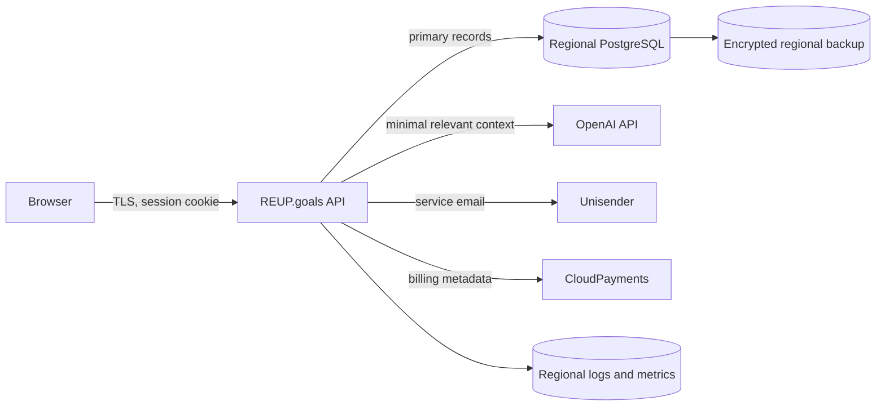

# Data map and retention

## System map

The API is the policy-enforcement point. The browser never calls OpenAI directly. Region routing must happen before authentication creates a workspace; moving a workspace between regions requires an explicit migration, audit event, and customer notice where applicable.

## Retention schedule

| Record | Default | Deletion rule |
| --- | ---: | --- |
| Expired/used auth codes | 30 days | automatic |
| HTTP request metadata | 90 days | automatic; no request bodies |
| AI call metadata | 180 days | automatic; no prompts or model output |
| Product events | 365 days | automatic; properties must not contain user content |
| Completed/failed background jobs | 30 days | automatic |
| Legal acceptance evidence | 3 years | automatic except the latest state per subject/document |
| Completed privacy requests | 3 years | automatic |
| Business workspace content | account/workspace lifetime | explicit deletion; legal holds are exceptional and documented |
| OpenAI files/vector stores | workspace/account lifetime | explicit provider deletion before local identifiers are erased |
| PostgreSQL backups | target maximum 30 days | provider lifecycle; restore tests must confirm deletion behavior |
| Billing/accounting records | legal schedule | confirmed by finance/legal owner, separate from product content |

Retention runs at startup and on `RETENTION_INTERVAL`. PostgreSQL advisory locking makes duplicate cleanup safe when several application instances run. The cleanup intentionally does not delete unfinished privacy requests or active business content.

## Data minimization rules

- Do not put prompts, user messages, documents, audio, tokens, passwords, email codes, or payment details in logs.
- AI context must contain the smallest source set that still preserves answer quality.
- Uploaded source files must be deleted from OpenAI when the Knowledge Base or account is deleted.
- Product analytics properties contain event names, entity IDs, status, and timing, not free-form business text.
- Production backups and logs stay in the workspace's approved region.
